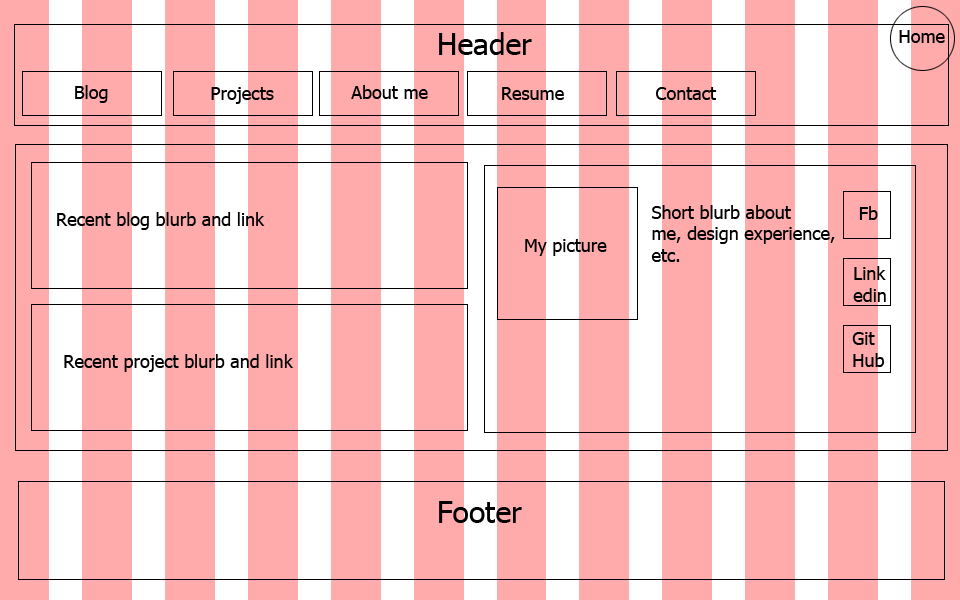
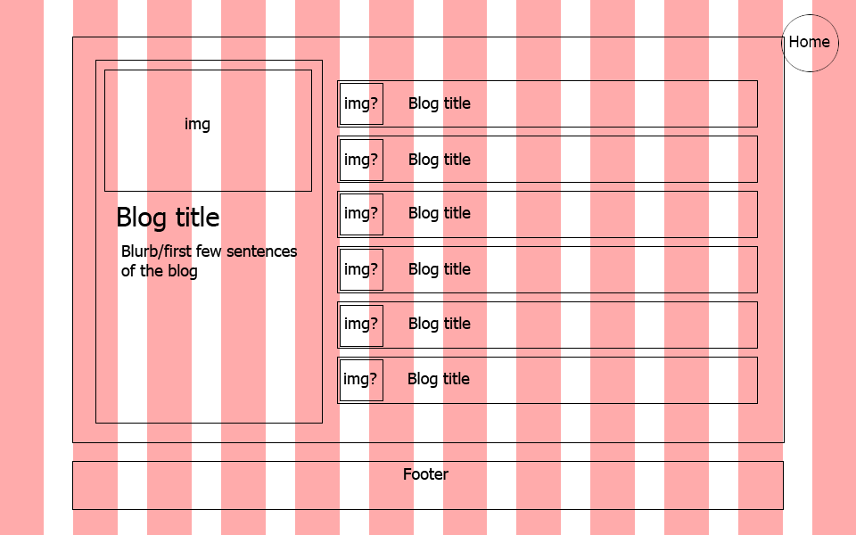

<!doctype html>
<html>
<head>
	<title>2.4 Wireframing Reflection</title>
</head>
<body>
<h1>2.4 Wireframing Reflection</h1>
<h3>Wireframe Index</h3>

<h3>Wireframe Blog Index</h3>

<ul>
	<li><h3>What is a wireframe?</h3></li>
		

			A wireframe is a (generally) black and white mockup of your website using simple boxes and typeface. You can imagine the wireframe as a blueprint of your site. It shows the general layout you'll plan to follow when designing and coding.
		

	<li><h3>What are the benefits of wireframing?</h3><li>
		

			Wireframes are a useful starting place when doing any kind of web design. It allows the designer to plan out how they're going to put the site together without worrying about the little details, such as color or typeface. It also lets the designer plan out how the user is going to interact with and navigate the site.
		

	<li><h3>Did you enjoy wireframing your site?</h3></li>
		

			It was an important step, but I don't know if I would exactly say I <em>enjoyed</em> it. I think my wireframe is okay, but I can't help but feel that there's probably a better setup. Well, for now this is my working layout. I'll see later if I get any better ideas.
		

	<li><h3>Did you revise your wireframe or stick with your first idea?</h3><li>
		

			I ended up revising my blog index wireframe a bit, but not my main index one. I actually think my blog index is not bad, though I couldn't decide if I should add my header bar to it in the end. Any thoughts? 
		

	<li><h3>What questions did you ask during this challenge? What resources did you find to help you answer them?</h3></li>
		

			One of my main questions was whether I should put the menu bar in the header or on the left side. After looking at a few website from the Beginner's Guide to Wireframing, I decided to put it above, with the header.
		

	<li><h3>Which parts of the challenge did you enjoy and which parts did you find tedious?</h3></li>
		

			The whole challenge was somewhere in the middle for me. The reading was extremely helpful, but not terribly riveting. The wireframing was almost enjoyable. It was kinda cool to make a plan, but I wish I had a better idea of what I'm doing. I think it might just take more experience.
		

</ul>
</body>
</html>