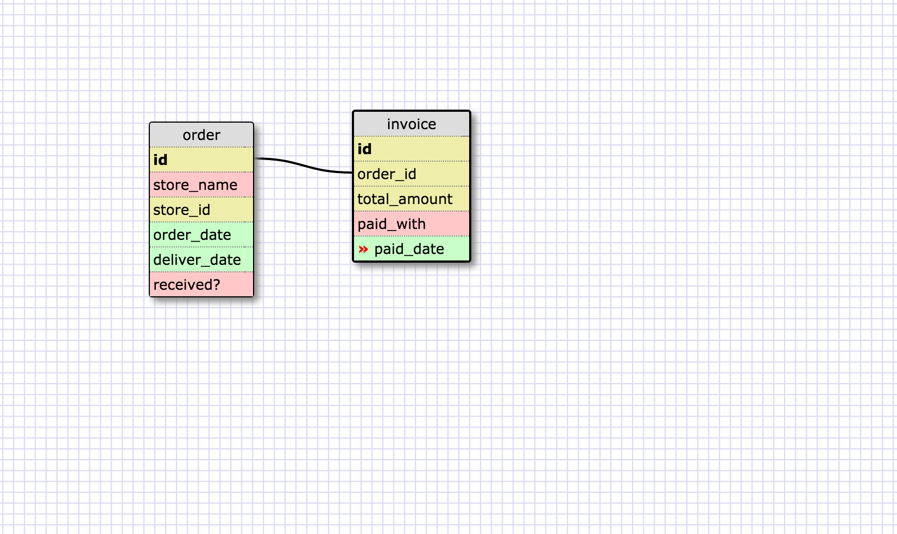
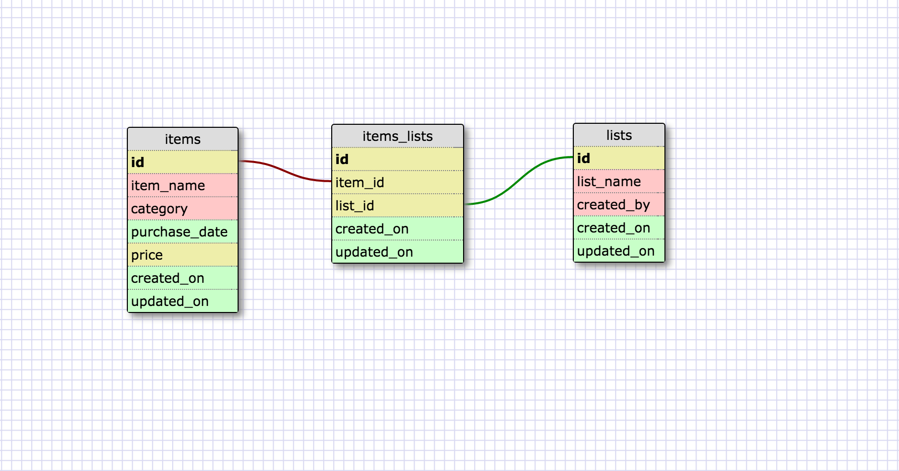

#Release 2: one-to-one

This schema could be for a franchise that takes orders from individual stores and ships out the product, invoicing only once it's been shipped. Orders can only have one invoice, and invoices can only be applied to one order. However, the invoice will be NULL until the order is shipped. This could be cumbersome since there are a lot of fields related to invoice which could also turn up as NULL. Therefore, it's better to make two separte tables to store the info.

#Release 4: many-to-many

#Release 6: Reflection
###What is a one-to-one database?

  A one-to-one relationship is where two things are basically pairs. That is, object "A" can only have one "B", and object "B" can only have one "A". A one to one database is used when object "A" may or may not have a "B". In a table, this would mean that there would be places where the field for "B" would be NULL. This can be especially troublesome if object "B" has multiple fields of its own.

###When would you use a one-to-one database? (Think generally, not in terms of the example you created).

  As mentioned above, it would be useful to have a one-to-one database when a lot of additional fields in a table would turn up NULL if one optional field turned up NULL.

###What is a many-to-many database?

  A many-to-many database is where two categories are connected, but both can encompass multiple objects. Consider a situation where object "A" can have multiple "B"s, and object "B" can have multiple "A"s as well. For example, breeds of dog and breeders would have a many-to-many relationship as a breed of dog can have many breeders, and a breeder can breed many different kinds of dog. This relationship makes a many-to-many database.

###When would you use a many-to-many database? (Think generally, not in terms of the example you created).

  Well, you would use it when you have two (or more) ojects that contain multiple instances of the other. Another example would be for researchers and articles. A researcher can have multiple articles, and an article can have multiple researchers.

###What is confusing about database schemas? What makes sense?

  I had some trouble wrapping my head around the fact that the fields were columns, not rows, in the table at first. It also took me some time to come up with an example of a one-to-one relationship. Seeing a database is a lot easier than designing one. Anyway, I suppose the difference between primary and foreign keys makes a lot of sense.